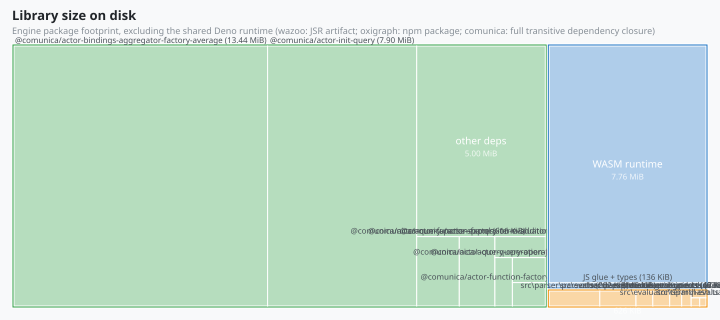
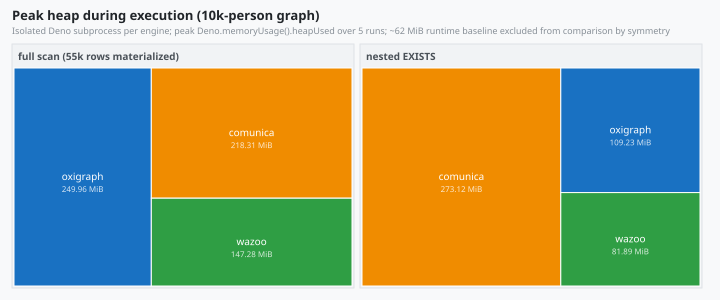

# @wazoo/sparql-engine

Wazoo-native SPARQL 1.1 & 1.2 Query & Update Engine over RDF/JS Quad Stores.

## Key capabilities

- **SPARQL 1.1 & 1.2 Query Engine**: Native evaluation of `SELECT`, `ASK`,
  `CONSTRUCT`, and `DESCRIBE` queries over `rdfjs.Store` sources — including
  SPARQL 1.2 direction functions (`LANGDIR`, `STRLANGDIR`, `hasLang`,
  `hasLangDir`) and RDF 1.2 reified triple terms (`<< s p o >>`).
- **SPARQL 1.1 & 1.2 Update Engine**: Support for `INSERT DATA`, `DELETE DATA`,
  `DELETE/INSERT`, `LOAD`, and atomic patch transactions, including updates over
  reified triple terms.
- **W3C SPARQL 1.2 Gate**: CI runs the W3C SPARQL 1.2 evaluation suite
  differentially against Comunica — currently **249/249** pass — plus **41/41**
  on the RDF 1.2 eval-triple-terms gap suite.
- **Zero Runtime Dependencies**: Lightweight AST parsing via the in-repo SPARQL
  parser (a maintained sparqljs 3.7.4 grammar), plus an in-repo jison
  Turtle/TriG/N-Triples/N-Quads parser backing `LOAD` (including RDF 1.2 triple
  terms, reifiers, and annotations); zero runtime dependencies (only type-only
  `@rdfjs/types`), and no Comunica framework overhead — browser-friendly and
  JSR-ready without transitive npm baggage.
- **JSR & Deno Native**: Published on JSR as `@wazoo/sparql-engine` for Deno,
  Node.js, and browser environments.
- **Drop-in for `@worlds/client`**: Implements the same `SparqlEngineInterface`
  as `ComunicaSparqlEngine` (`@worlds/client/comunica`), so it can be swapped
  into a `Client` without client changes.

## Usage

```typescript
import {
  DataFactory,
  MemoryStore,
  WazooSparqlEngine,
} from "@wazoo/sparql-engine";

const { namedNode, literal, quad } = DataFactory;
const store = new MemoryStore();
store.addQuad(
  quad(
    namedNode("https://example.org/alice"),
    namedNode("https://xmlns.com/foaf/0.1/name"),
    literal("Alice"),
  ),
);

const engine = new WazooSparqlEngine({ store });

const result = await engine.execute({
  query: "SELECT ?s ?p ?o WHERE { ?s ?p ?o }",
});

if (result.kind === "select") {
  console.log(result.data.results.bindings);
}
```

## Tree-shakeable subpath imports

The package also exposes four subpath entrypoints, so a consumer that only needs
one layer never loads the whole engine graph. Each subpath's import closure is
measured by `deno task bench:size:closures` — a store-only app pays **53 KiB
instead of 576 KiB**, and the serializers are the cheapest leaf at 7.4 KiB.

### `@wazoo/sparql-engine/term` — term algebra (40.3 KiB)

RDF/JS term construction, hashing, comparison, and conversion, without the
evaluator:

```typescript
import { DataFactory, sameRdfTerm, termKey } from "@wazoo/sparql-engine/term";

const { literal, namedNode } = DataFactory;
const xsd = "http://www.w3.org/2001/XMLSchema#";
const a = literal("42", namedNode(xsd + "integer"));
const b = literal("42", namedNode(xsd + "integer"));

termKey(a); // stable hash key for maps/sets
sameRdfTerm(a, b); // structural equality incl. datatype → true
```

### `@wazoo/sparql-engine/store` — RDF/JS quad store (53.1 KiB)

The zero-dependency in-memory store, implementing the full `rdfjs.Store`
interface — no query engine attached:

```typescript
import { DataFactory } from "@wazoo/sparql-engine/term";
import { MemoryStore } from "@wazoo/sparql-engine/store";

const { literal, namedNode, quad } = DataFactory;
const store = new MemoryStore([
  quad(
    namedNode("https://example.org/alice"),
    namedNode("https://xmlns.com/foaf/0.1/name"),
    literal("Alice"),
  ),
]);

// `match` returns an RDF/JS stream (async iterable)
for await (const q of store.match(namedNode("https://example.org/alice"))) {
  console.log(q.object.value); // "Alice"
}
```

### `@wazoo/sparql-engine/parser` — SPARQL AST parser (213.8 KiB)

Parse SPARQL 1.1 & 1.2 into the sparqljs-compatible AST without loading the
evaluator:

```typescript
import { SparqlParser } from "@wazoo/sparql-engine/parser";

const ast = new SparqlParser({ sparqlStar: true }).parse(
  "SELECT ?s WHERE { ?s ?p ?o }",
);
console.log(ast.type); // "query"
console.log(ast.variables); // [Variable{ value: "s" }]
```

### `@wazoo/sparql-engine/serialize` — results writers (7.4 KiB)

Serialize a `SparqlResponse` to SPARQL results JSON (`.srj`) or XML (`.srx`):

```typescript
import {
  serializeJsonResults,
  serializeXmlResults,
} from "@wazoo/sparql-engine/serialize";

const response = {
  kind: "select",
  data: {
    head: { vars: ["s"] },
    results: {
      bindings: [
        { s: { type: "uri", value: "https://example.org/alice" } },
      ],
    },
  },
};

serializeJsonResults(response); // {"head":{"vars":["s"]},"results":…}
serializeXmlResults(response); // <?xml version="1.0" encoding="UTF-8"?>…
```

The subpaths can be mixed freely — e.g. the store above with the term layer, or
the serializers fed by `engine.execute()`'s response. Anything not re-exported
through `./term`, `./store`, `./parser`, or `./serialize` (or the root
entrypoint) is private surface.

## Parity testing

The differential test suite in `test/parity/` proves behavioral equivalence with
`@comunica/query-sparql-rdfjs-lite`, the engine this project ports 1:1. Every
case seeds both engines with identical RDF/JS stores, runs the same query
through each, and deep-compares the observable results: SELECT bindings
(projected variables and values, with ORDER BY emission order compared exactly),
ASK booleans, and CONSTRUCT quads.

Blank nodes are compared by identity, not by label. Comunica skolemizes blank
nodes from query sources into prefixed labels (`bc_<sourceId>_<label>`); the
native engine returns the store's own labels. SPARQL 1.1 result semantics treat
blank node labels as scoped and opaque, so the native engine deliberately does
not replicate the prefix — the harness strips it from Comunica's output before
comparing (see `test/parity/parity-harness.ts`). A test in
`test/parity/parity.test.ts` locks in this known difference against real
Comunica output, so the normalization stays verified rather than assumed.

SPARQL updates are covered the same way in `test/parity/parity-update.test.ts`:
INSERT DATA, DELETE DATA, INSERT WHERE, DELETE WHERE, and DELETE/INSERT (plain,
typed, and language-tagged literals, fresh blank nodes per solution, named graph
templates, joins in WHERE, and composite requests) run against both engines on
identical seed stores, and the final store contents are compared. Because INSERT
DATA mints fresh blank node labels per execution (`e_<label>NN` under Comunica,
`u<N>` natively), the harness canonicalizes store contents up to blank node
relabeling — two stores pass when they agree exactly modulo label identity,
which is the SPARQL contract.

## Benchmarking

`bench/engine_bench.ts` compares query and update execution against both
`@comunica/query-sparql-rdfjs-lite` and the Oxigraph WASM engine (`oxigraph`)
over an identical generated graph. Before timing, every run asserts that all
three engines return identical results for each query, and for updates asserts
that they produce identical final store contents after mutating fresh stores (a
move update, which a broken engine that ignores updates cannot pass). The timed
update is a self-restoring delete+insert rewrite, so iterations never drift the
benchmark stores. The reorder-chain group demonstrates the dynamic join
ordering: a three-pattern chain written in worst-case order runs ~90x faster
with reordering enabled, because the planner scans each pattern once and joins
in order of estimated cost, preferring patterns whose variables are already
bound. Timings use Deno's built-in bench runner with the native engine as the
per-group baseline:

```bash
deno task bench
```

### Results

A snapshot measured on a Windows desktop with Deno 2.9.5 (native engine as the
per-group baseline). Each cell is the per-iteration average; every query is
cross-verified to return identical results on all three engines before timing.
Timings are machine-specific — run `deno task bench` for your own numbers.

Core joins, 400-person graph (~2,200 quads):

| query                        | native   | comunica | oxigraph |
| ---------------------------- | -------- | -------- | -------- |
| full scan                    | 1.3 ms   | 7.6 ms   | 12.2 ms  |
| join (knows × name)          | 1.0 ms   | 5.2 ms   | 2.6 ms   |
| asymmetric join              | 1.4 ms   | 29.2 ms  | 15.1 ms  |
| reorder chain, written order | 136.5 ms | 193.2 ms | 3.2 ms   |
| reorder chain, planner on    | 1.5 ms   | —        | —        |

EXISTS surface, 400-person graph:

| query               | native  | comunica | oxigraph |
| ------------------- | ------- | -------- | -------- |
| `FILTER EXISTS`     | 0.81 ms | 29.2 ms  | 1.0 ms   |
| `FILTER NOT EXISTS` | 0.88 ms | 33.3 ms  | 1.3 ms   |
| nested `EXISTS`     | 1.1 ms  | 134.6 ms | 1.3 ms   |
| nested `NOT EXISTS` | 1.1 ms  | 134.1 ms | 1.2 ms   |

EXISTS surface, 10,000-person graph (~55,000 quads):

| query               | native  | comunica | oxigraph |
| ------------------- | ------- | -------- | -------- |
| `FILTER EXISTS`     | 27.8 ms | 729.5 ms | 27.0 ms  |
| `FILTER NOT EXISTS` | 26.8 ms | 835.9 ms | 30.7 ms  |
| nested `EXISTS`     | 41.3 ms | 3.1 s    | 43.3 ms  |
| nested `NOT EXISTS` | 39.6 ms | 3.2 s    | 32.3 ms  |

Scaling the data 25x (400 → 10,000 people) grows native's EXISTS cost ~35-40x
while the nested-vs-simple ratio _shrinks_ (1.45x → 1.12x): the snapshot is
drained and indexed once per query, and each probe touches only its candidate
bucket, so nesting stays cheap relative to the dataset. Across the exists
surface native is 20-180x faster than comunica and roughly at parity with
oxigraph (a compiled Rust/WASM engine with native indexes, which remains ahead
on the reorder-chain row); on the core scan/join rows native is the fastest of
the three.

Join surface, 10,000-person graph (~55,000 quads) — UNION joins 10k x 20k
bindings on the shared subject (~200M candidate pairs); OPTIONAL and MINUS join
10k x 5k (~50M pairs). The native engine's hash join probes an indexed right
side per left binding instead of scanning it:

| query               | native  | comunica | oxigraph |
| ------------------- | ------- | -------- | -------- |
| UNION (10k x 20k)   | 45.1 ms | 106.6 ms | 107.5 ms |
| OPTIONAL (10k x 5k) | 22.1 ms | 587.9 ms | 56.5 ms  |
| MINUS (10k x 5k)    | 18.0 ms | 41.7 ms  | 23.1 ms  |

On this surface native leads all three engines, and the fan-out join scaling is
sub-quadratic: the nested-loop before-state for the same UNION was ~7 s/iter
versus 45 ms with the hash join (~150x), with OPTIONAL and MINUS showing the
same shape (~60-80x).

### Size & memory footprint

The speed comparison is only half the story — engines also differ by orders of
magnitude in what they cost to ship and to run. Two treemaps (area ∝ size)
summarize both:

**Library size on disk** — what a consumer must have installed:



| engine   | on disk      | contents                                                                                                                                        |
| -------- | ------------ | ----------------------------------------------------------------------------------------------------------------------------------------------- |
| native   | **0.61 MiB** | 37 files (the whole JSR artifact: `src/` + `README.md` + `LICENSE`; build-time grammars + unreachable code excluded); zero runtime dependencies |
| oxigraph | 7.9 MiB      | WASM runtime (7.8 MiB) + JS glue/types                                                                                                          |
| comunica | 28.3 MiB     | 368 npm packages in the transitive dependency closure                                                                                           |

Regenerated by `deno task bench:size`. The native artifact is **~0.61 MiB on
disk (~0.13 MiB gzipped)** — the JSR `publish.exclude` drops the build-time
grammar sources (`*.jison`, `generate-parser.ts`, ~88 KiB) and the unreachable
Node-only `sqlite-store.ts` (~11 KiB), so consumers never install build
artifacts; the treemap and the `bench:size` JSON both mirror that file set
exactly.

**Per-entrypoint consumer closure** — what importing a subpath actually loads
from the published package (value-import graph, type-only imports erased;
measured by `deno task bench:size:closures`):

| import                               | closure     |
| ------------------------------------ | ----------- |
| `@wazoo/sparql-engine/serialize`     | **7.4 KiB** |
| `@wazoo/sparql-engine/term`          | 40.3 KiB    |
| `@wazoo/sparql-engine/store`         | 53.1 KiB    |
| `@wazoo/sparql-engine/parser`        | 213.8 KiB   |
| `@wazoo/sparql-engine` (full engine) | 575.9 KiB   |

A store-only consumer pays **53 KiB instead of the whole 576 KiB engine graph**,
and the serializers are the cheapest leaf at 7.4 KiB — just the two writers,
since they only import types from the engine.

**Peak heap during execution** on the 10k-person graph (55k quads), measured in
an isolated Deno subprocess per engine (peak `Deno.memoryUsage().heapUsed` over
5 runs; all three share the same ~65 MB runtime baseline, so the comparison is
symmetric):



| workload             | native     | comunica | oxigraph |
| -------------------- | ---------- | -------- | -------- |
| full scan (55k rows) | **134 MB** | 214 MB   | 251 MB   |
| nested EXISTS        | **82 MB**  | 271 MB   | 108 MB   |

Native is the smallest on disk by 13-46x (0.61 vs 7.9 vs 28.3 MiB) and holds its
speed advantage with the lowest peak heap on both workloads — including a peak
roughly a third of comunica's on the nested-EXISTS surface the timings above
highlight. Oxigraph's WASM runtime is compact on disk, but its result
materialization peaks higher than native on both workloads.

These are machine-specific snapshots (Deno 2.9.5, Windows), not guarantees.
Regenerate them with `deno task bench:size` (library sizes, from the installed
packages) and `deno task bench:memory` (peak memory, spawned per engine), which
write the SVGs into `docs/assets/`.

## Development

```bash
deno task ci
```

## Query design notes

Most performance work is the engine's job and happens automatically: greedy join
reordering, hash joins over shared variables, the positional store index, and
the once-per-query EXISTS snapshot with indexed probes. The query shapes below
are expensive **by semantics** — the cost is proportional to the result the
query itself asks for, so no engine can make them cheap without changing the
answer. Treat them as the operator's responsibility:

- **Joins with no shared variables.** A join (BGP patterns, UNION branches,
  OPTIONAL, MINUS) over disjoint variable sets is a cross product — n·m rows by
  definition, per SPARQL §18.2.2's natural join on an empty key. The hash join
  does not change this: the result size _is_ the cost. Correlate the sides on a
  shared variable (typically the subject). The same trap applies to
  `OPTIONAL { ?x <pet> ?p }` whose group shares nothing with the outer query —
  every outer row merges with every group row; bind the group to the outer
  solution instead.
- **Property paths with both endpoints unbound.** `?a <knows>+ ?b` walks the
  path forward from every graph node, because the reachable-set has to be
  computed before any solution can be formed. Binding one endpoint
  (`<person1> <knows>+ ?b`) turns it into one anchored walk; reflexive forms
  (`?`, `*`) additionally materialize the (node, node) pair.
- **Queries whose result is the whole store.** `SELECT * WHERE { ?s ?p ?o }`
  over 55k quads materializes 55k rows; the positional index makes each pattern
  scan O(bucket) instead of O(store), but the result materialization is
  inherent. Bind a selective subject, push FILTERs down, or use LIMIT — the
  engine evaluates everything before slicing, so a small LIMIT over a huge scan
  still pays the scan (streaming is tracked as #74).
- **Correlated EXISTS over broad scopes.** EXISTS snapshots drain and index once
  per query, and probes touch only the candidate bucket — but a correlated
  `FILTER EXISTS { ?s <knows> ?who }` whose correlation variable is bound
  _outside_ the EXISTS still runs once per outer solution. Bind the correlation
  variable in the outer query.
- **Non-selective data shapes.** If every node is connected to every node, the
  compatible-candidate set for a join _is_ the whole right side, and no join
  strategy beats scanning it. Prefer selective predicates on the hot path —
  indexes help only when buckets are smaller than the full set.

## Releases

Every merge to `main` runs the Publish workflow. Following the standard JSR
publish convention — `deno publish` will not attempt to publish a version that
is already on JSR — a release ships **only when `deno.json`'s `version` is
bumped** to something newer than the published latest:

- **Release PR** (bumps `version`): the Publish job publishes the new version;
  if it somehow skips anyway, the job fails loudly.
- **Routine PR** (no bump): the Publish job skips with a notice — this is
  expected, not an error.

To ship a release, bump `version` in `deno.json` (minor for additive public API,
patch for fixes) in the same PR that should publish.
