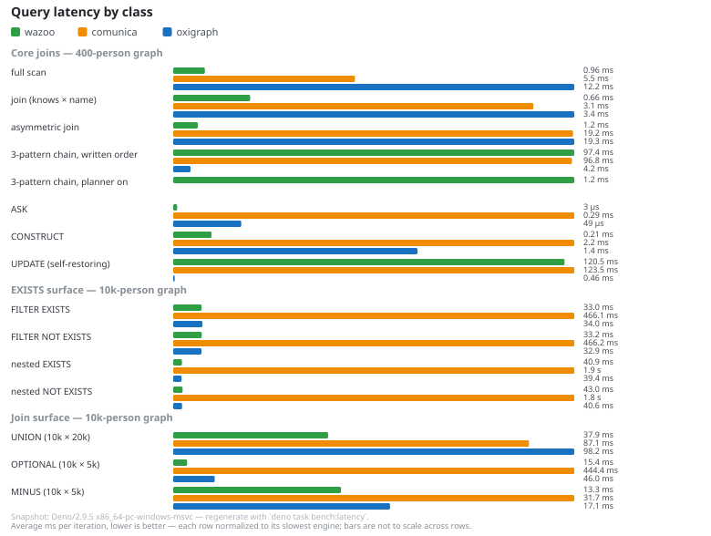

<p align="center">
  <a href="https://docs.wazoo.dev">
    
  </a>
  <br /><br />
  <em>Zero-dependency SPARQL 1.1 &amp; 1.2 query and update engine over RDF/JS quad stores.</em>
  <br /><br />
  <a href="https://jsr.io/@wazoo/sparql-engine"></a>
  <a href="https://jsr.io/@wazoo/sparql-engine/score"></a>
  <a href="https://github.com/wazootech/sparql-engine"></a>
  <a href="https://deepwiki.com/wazootech/sparql-engine"></a>
</p>

Wazoo [SPARQL 1.1](https://www.w3.org/TR/sparql11-query/) & 1.2 Query & Update
Engine over RDF/JS Quad Stores.

## Compatibility

- **SPARQL 1.1 — full.** `SELECT` / `ASK` / `CONSTRUCT` / `DESCRIBE`, UPDATE,
  property paths, aggregation, subqueries, `VALUES`, and filters over any RDF/JS
  quad store. Gated by the [W3C](https://www.w3.org/) SPARQL 1.1 evaluation
  suite (differential vs [Comunica](https://comunica.dev/)): **345/345**.
- **[SPARQL 1.2](https://www.w3.org/TR/sparql12-query/) — working-draft surface
  implemented.** Direction functions (`LANGDIR`, `STRLANGDIR`, `hasLang`,
  `hasLangDir`; `hasLang` is variadic, 1–3 args, as a documented superset
  extension), RDF 1.2 reified triple terms (`<< s p o >>`) in patterns, paths,
  and updates, and the 1.2 lexical/grammar surface (a single
  Turtle/TriG/N-Triples/N-Quads superset grammar backing `LOAD`). Gated by the
  W3C SPARQL 1.2 evaluation suite (**249/249**), the RDF 1.2 eval-triple-terms
  gap suite (**41/41**), and the RDF 1.1/1.2 grammar gates.
- **CI-enforced.** Every gate above runs in the `w3c-parity` CI job — a
  spec-required behavior that regresses fails the build rather than silently
  drifting.

See [docs/05 — Verification & Testing](docs/05-testing.md) for the suite
inventory and [docs/06 — Supplemental Context](docs/06-supplemental-context.md)
for the W3C suite notes.

## Key capabilities

- **SPARQL 1.1 & 1.2 Query Engine**: Wazoo evaluation of `SELECT`, `ASK`,
  `CONSTRUCT`, and `DESCRIBE` queries over `rdfjs.Store` sources — including
  SPARQL 1.2 direction functions (`LANGDIR`, `STRLANGDIR`, `hasLang`,
  `hasLangDir`) and RDF 1.2 reified triple terms (`<< s p o >>`).
- **SPARQL 1.1 & 1.2 Update Engine**: Support for `INSERT DATA`, `DELETE DATA`,
  `DELETE/INSERT`, `LOAD`, and atomic patch transactions, including updates over
  reified triple terms.
- **W3C SPARQL 1.2 Gate**: CI runs the W3C SPARQL 1.2 evaluation suite
  differentially against Comunica — currently **249/249** pass — plus **41/41**
  on the RDF 1.2 eval-triple-terms gap suite.
- **Zero Runtime Dependencies**: Lightweight AST parsing via the in-repo SPARQL
  parser (a maintained sparqljs 3.7.4 grammar), plus an in-repo jison
  Turtle/TriG/N-Triples/N-Quads parser backing `LOAD` (including RDF 1.2 triple
  terms, reifiers, and annotations); zero runtime dependencies (only type-only
  `@rdfjs/types`), and no Comunica framework overhead — browser-friendly and
  JSR-ready without transitive npm baggage.
- **JSR & Deno Wazoo**: Published on JSR as `@wazoo/sparql-engine` for Deno,
  Node.js, and browser environments.
- **Drop-in for `@worlds/client`**: Implements the same
  [`SparqlEngineInterface`](https://jsr.io/@wazoo/sparql-engine/doc/~/SparqlEngineInterface)
  as `ComunicaSparqlEngine` (`@worlds/client/comunica`), so it can be swapped
  into a `Client` without client changes.

## Usage

```typescript
import {
  DataFactory,
  MemoryStore,
  WazooSparqlEngine,
} from "@wazoo/sparql-engine";

const { namedNode, literal, quad } = DataFactory;
const store = new MemoryStore();
store.addQuad(
  quad(
    namedNode("https://example.org/alice"),
    namedNode("https://xmlns.com/foaf/0.1/name"),
    literal("Alice"),
  ),
);

const engine = new WazooSparqlEngine({ store });

const result = await engine.execute({
  query: "SELECT ?s ?p ?o WHERE { ?s ?p ?o }",
});

if (result.kind === "select") {
  console.log(result.data.results.bindings);
}
```

## Tree-shakeable subpath imports

The package also exposes five subpath entrypoints — `./term`, `./data-model`,
`./store`, `./parser`, and `./serialize` — so a consumer that only needs one
layer never loads the whole engine graph.

### `@wazoo/sparql-engine/term` — term algebra

RDF/JS term construction, hashing, comparison, and conversion, without the
evaluator:

```typescript
import { DataFactory, sameRdfTerm, termKey } from "@wazoo/sparql-engine/term";

const { literal, namedNode } = DataFactory;
const xsd = "http://www.w3.org/2001/XMLSchema#";
const a = literal("42", namedNode(xsd + "integer"));
const b = literal("42", namedNode(xsd + "integer"));

termKey(a); // stable hash key for maps/sets
sameRdfTerm(a, b); // structural equality incl. datatype → true
```

### `@wazoo/sparql-engine/data-model` — RDF/JS DataFactory

The zero-dependency RDF/JS term factory under the name RDF/JS consumers expect —
an alias of `./term` re-exporting the same module:

```typescript
import { DataFactory } from "@wazoo/sparql-engine/data-model";

const { blankNode, literal, namedNode, quad } = DataFactory;
const alice = quad(
  namedNode("https://example.org/alice"),
  namedNode("https://xmlns.com/foaf/0.1/name"),
  literal("Alice"),
);
```

`/data-model` and `/term` are the same module — importing `DataFactory` from
either yields the identical object, so the two paths can never drift.

### `@wazoo/sparql-engine/store` — RDF/JS quad store

The zero-dependency in-memory store, implementing the full `rdfjs.Store`
interface — no query engine attached:

```typescript
import { DataFactory } from "@wazoo/sparql-engine/term";
import { MemoryStore } from "@wazoo/sparql-engine/store";

const { literal, namedNode, quad } = DataFactory;
const store = new MemoryStore([
  quad(
    namedNode("https://example.org/alice"),
    namedNode("https://xmlns.com/foaf/0.1/name"),
    literal("Alice"),
  ),
]);

// `match` returns an RDF/JS stream (async iterable)
for await (const q of store.match(namedNode("https://example.org/alice"))) {
  console.log(q.object.value); // "Alice"
}
```

### `@worlds/sqlite` — durable SQLite store

The durable `node:sqlite` store moved out of this package into
[`@worlds/sqlite`](https://github.com/wazootech/worlds-sqlite) (the RDF/JS store
is packaged with the worlds impl). The engine stays store-agnostic and consumes
it through the `createTransaction` hook:

```typescript
import { SqliteStore } from "@worlds/sqlite";
import { WazooSparqlEngine } from "@wazoo/sparql-engine";

const store = new SqliteStore({ path: "data.sqlite" });
const engine = new WazooSparqlEngine({
  store,
  createTransaction: () => store.createTransaction(),
});
```

### `@wazoo/sparql-engine/parser` — SPARQL AST + Turtle parsers

Parse SPARQL 1.1 & 1.2 into the sparqljs-compatible AST without loading the
evaluator, and parse Turtle-family documents into RDF/JS quads:

```typescript
import { parseTurtleQuads, SparqlParser } from "@wazoo/sparql-engine/parser";

const ast = new SparqlParser({ sparqlStar: true }).parse(
  "SELECT ?s WHERE { ?s ?p ?o }",
);
console.log(ast.type); // "query"
console.log(ast.variables); // [Variable{ value: "s" }]

// Turtle / TriG / N-Triples / N-Quads → RDF/JS quads (graphs preserved)
const quads = parseTurtleQuads(
  '@prefix : <https://example.org/> . :alice :name "Alice" .',
);
console.log(quads[0].object.value); // "Alice"
```

### `@wazoo/sparql-engine/serialize` — results writers + Turtle writer

Serialize a
[`SparqlResponse`](https://jsr.io/@wazoo/sparql-engine/doc/~/SparqlResponse) to
SPARQL results JSON (`.srj`) or XML (`.srx`), or RDF/JS quads to
Turtle/TriG/N-Quads/N-Triples:

```typescript
import {
  serializeJsonResults,
  serializeTurtle,
  serializeXmlResults,
} from "@wazoo/sparql-engine/serialize";

const response = {
  kind: "select",
  data: {
    head: { vars: ["s"] },
    results: {
      bindings: [
        { s: { type: "uri", value: "https://example.org/alice" } },
      ],
    },
  },
};

serializeJsonResults(response); // {"head":{"vars":["s"]},"results":…}
serializeXmlResults(response); // <?xml version="1.0" encoding="UTF-8"?>…

// The writer counterpart to parseTurtleQuads — lossless round-trip, incl.
// RDF 1.2 triple terms and named graphs (TriG blocks in Turtle mode).
serializeTurtle(quads, {
  format: "turtle",
  prefixes: { ex: "https://example.org/" },
});
serializeTurtle(quads, { format: "n-quads" });
```

The subpaths can be mixed freely — e.g. the store above with the term layer, or
the serializers fed by `engine.execute()`'s response. Anything not re-exported
through `./term`, `./data-model`, `./store`, `./parser`, or `./serialize` (or
the root entrypoint) is private surface.

## Parity testing

The differential test suite in `test/parity/` proves behavioral equivalence with
`@comunica/query-sparql-rdfjs-lite`, the engine this project ports 1:1. Every
case seeds both engines with identical RDF/JS stores, runs the same query
through each, and deep-compares the observable results: SELECT bindings
(projected variables and values, with ORDER BY emission order compared exactly),
ASK booleans, and CONSTRUCT quads.

Blank nodes are compared by identity, not by label. Comunica skolemizes blank
nodes from query sources into prefixed labels (`bc_<sourceId>_<label>`); the
wazoo engine returns the store's own labels. SPARQL 1.1 result semantics treat
blank node labels as scoped and opaque, so the wazoo engine deliberately does
not replicate the prefix — the harness strips it from Comunica's output before
comparing (see `test/parity/parity-harness.ts`). A test in
`test/parity/parity.test.ts` locks in this known difference against real
Comunica output, so the normalization stays verified rather than assumed.

SPARQL updates are covered the same way in `test/parity/parity-update.test.ts`:
INSERT DATA, DELETE DATA, INSERT WHERE, DELETE WHERE, and DELETE/INSERT (plain,
typed, and language-tagged literals, fresh blank nodes per solution, named graph
templates, joins in WHERE, and composite requests) run against both engines on
identical seed stores, and the final store contents are compared. Because INSERT
DATA mints fresh blank node labels per execution (`e_<label>NN` under Comunica,
`u<N>` natively), the harness canonicalizes store contents up to blank node
relabeling — two stores pass when they agree exactly modulo label identity,
which is the SPARQL contract.

## Benchmarking

`bench/engine_bench.ts` compares query and update execution against both
`@comunica/query-sparql-rdfjs-lite` and the Oxigraph WASM engine (`oxigraph`)
over an identical generated graph. Before timing, every run asserts that all
three engines return identical results for each query, and for updates asserts
that they produce identical final store contents after mutating fresh stores (a
move update, which a broken engine that ignores updates cannot pass). The timed
update is a self-restoring delete+insert rewrite, so iterations never drift the
benchmark stores. The reorder-chain group demonstrates the dynamic join
ordering: a three-pattern chain written in worst-case order runs ~80x faster
with reordering enabled, because the planner scans each pattern once and joins
in order of estimated cost, preferring patterns whose variables are already
bound. Timings use Deno's built-in bench runner with the wazoo engine as the
per-group baseline:

```bash
deno task bench
```

### Results

A snapshot measured on a Windows desktop with Deno 2.9.5 (wazoo engine as the
per-group baseline). Each cell is the per-iteration average; every query is
cross-verified to return identical results on all three engines before timing.
Timings are machine-specific — run `deno task bench` for your own numbers.

Core joins, 400-person graph (~2,200 quads):

| query                        | wazoo    | comunica | oxigraph |
| ---------------------------- | -------- | -------- | -------- |
| full scan                    | 1.1 ms   | 6.0 ms   | 8.8 ms   |
| join (knows × name)          | 0.91 ms  | 3.4 ms   | 1.6 ms   |
| asymmetric join              | 1.7 ms   | 23.0 ms  | 11.5 ms  |
| reorder chain, written order | 105.5 ms | 107.8 ms | 2.2 ms   |
| reorder chain, planner on    | 1.5 ms   | —        | —        |
| dp-join, DP plan             | 62.2 ms  | 190.4 ms | 1120 ms  |
| dp-join, greedy plan         | 125.2 ms | —        | —        |

EXISTS surface, 400-person graph:

| query               | wazoo   | comunica | oxigraph |
| ------------------- | ------- | -------- | -------- |
| `FILTER EXISTS`     | 0.70 ms | 21.5 ms  | 0.77 ms  |
| `FILTER NOT EXISTS` | 0.64 ms | 23.4 ms  | 0.85 ms  |
| nested `EXISTS`     | 0.87 ms | 88.8 ms  | 0.93 ms  |
| nested `NOT EXISTS` | 0.86 ms | 127.7 ms | 0.93 ms  |

EXISTS surface, 10,000-person graph (~55,000 quads):

| query               | wazoo   | comunica | oxigraph |
| ------------------- | ------- | -------- | -------- |
| `FILTER EXISTS`     | 20.1 ms | 499.0 ms | 22.2 ms  |
| `FILTER NOT EXISTS` | 19.3 ms | 484.7 ms | 21.4 ms  |
| nested `EXISTS`     | 25.9 ms | 3.1 s    | 26.4 ms  |
| nested `NOT EXISTS` | 26.8 ms | 2.2 s    | 31.5 ms  |

Scaling the data 25x (400 → 10,000 people) grows wazoo's EXISTS cost ~35x while
nesting stays within ~1.2x of the simple case at both scales: the snapshot is
drained and indexed once per query, and each probe touches only its candidate
bucket, so nesting stays cheap relative to the dataset. Across the exists
surface wazoo is ~15-65x faster than comunica and roughly at parity with

oxigraph (a compiled Rust/WASM engine with native indexes, which remains ahead
on the reorder-chain row); on the core scan/join rows wazoo is the fastest of
the three.

Join surface, 10,000-person graph (~55,000 quads) — UNION joins 10k x 20k
bindings on the shared subject (~200M candidate pairs); OPTIONAL and MINUS join
10k x 5k (~50M pairs). The wazoo engine's hash join probes an indexed right side
per left binding instead of scanning it:

| query               | wazoo   | comunica | oxigraph |
| ------------------- | ------- | -------- | -------- |
| UNION (10k x 20k)   | 37.9 ms | 87.1 ms  | 98.2 ms  |
| OPTIONAL (10k x 5k) | 15.4 ms | 444.4 ms | 46.0 ms  |
| MINUS (10k x 5k)    | 13.3 ms | 31.7 ms  | 17.1 ms  |

On this surface wazoo leads all three engines, and the fan-out join scaling is
sub-quadratic: the nested-loop before-state for the same UNION was ~7 s/iter
versus ~38 ms with the hash join (~185x), with OPTIONAL and MINUS showing the
same shape (~60-80x).

The same snapshot as a chart — one row per query class, three bars per row
(wazoo green, Comunica orange, Oxigraph blue), bar length proportional to avg
ms/iter within the row:

<figure>
  
  <figcaption><b>Fig — Query latency by class.</b> One row per query class;
  three bars per row, bar length proportional to average ms/iter within the
  row (each row normalized to its slowest engine — lower is better). The
  planner-only rows (3-pattern chain, planner on) have a single wazoo bar;
  Comunica and Oxigraph have no reordering equivalent. Snapshot from
  `bench/latency-data.json`, regenerated by `deno task bench:latency`.</figcaption>
</figure>

### Size & memory footprint

The speed comparison is only half the story — engines also differ by orders of
magnitude in what they cost to ship and to run. A size bar chart and a memory
treemap (length/area ∝ size) summarize both:

**Library size on disk** — what a consumer must have installed:

<figure>
  
  <figcaption><b>Fig 1 — Library size on disk.</b> One bar per engine; bar
  length is proportional to total installed size (values in binary MiB, share
  of the combined total in parentheses). Wazoo (green) is the whole JSR
  artifact at 0.67 MiB — a sliver against comunica’s 28.3 MiB closure (orange);
  oxigraph (blue) sits between.</figcaption>
</figure>

| engine   | on disk      | contents                                                                                                                     |
| -------- | ------------ | ---------------------------------------------------------------------------------------------------------------------------- |
| wazoo    | **0.67 MiB** | 41 files (the whole JSR artifact: `src/` + `README.md` + `LICENSE`; build-time grammars excluded); zero runtime dependencies |
| oxigraph | 7.9 MiB      | WASM runtime (7.8 MiB) + JS glue/types                                                                                       |
| comunica | 28.3 MiB     | 368 npm packages in the transitive dependency closure                                                                        |

Regenerated by `deno task bench:size`. The wazoo artifact is **~0.67 MiB on disk
(~0.15 MiB gzipped)** — the JSR `publish.exclude` drops the build-time grammar
sources (`*.jison`, `generate-parser.ts`, ~87 KiB). The durable SQLite store
moved to `@worlds/sqlite` (2026-08-17), so the root import graph is
server-optional. The chart and the `bench:size` JSON both mirror that file set
exactly.

**Peak heap during execution** on the 10k-person graph (55k quads), measured in
an isolated Deno subprocess per engine (peak `Deno.memoryUsage().heapUsed` over
5 runs; all three share the same ~62 MiB runtime baseline, so the comparison is
symmetric):

<figure>
  
  <figcaption><b>Fig 4 — Peak heap during execution</b> (10k-person graph).
  One panel per workload (full scan, nested EXISTS); within each, the three
  engines’ tiles are scaled by their peak `heapUsed` (values in MiB). Wazoo
  (green) is the smallest tile in both panels.</figcaption>
</figure>

| workload             | wazoo       | comunica | oxigraph |
| -------------------- | ----------- | -------- | -------- |
| full scan (55k rows) | **150 MiB** | 214 MiB  | 255 MiB  |
| nested EXISTS        | **80 MiB**  | 273 MiB  | 109 MiB  |

Wazoo is the smallest on disk by 12-42x (0.67 vs 7.9 vs 28.3 MiB) and holds its
speed advantage with the lowest peak heap on both workloads — including a peak
roughly a third of comunica's on the nested-EXISTS surface the timings above
highlight. Oxigraph's WASM runtime is compact on disk, but its result
materialization peaks higher than wazoo on both workloads.

These are machine-specific snapshots (Deno 2.9.5, Windows), not guarantees.
Regenerate them with `deno task bench:size` (library sizes, from the installed
packages) and `deno task bench:memory` (peak memory, spawned per engine), which
write the SVGs into `docs/assets/`.

## Development

```bash
deno task ci
```

## Query design notes

Most performance work is the engine's job and happens automatically: greedy join
reordering, hash joins over shared variables, the positional store index, and
the once-per-query EXISTS snapshot with indexed probes. The query shapes below
are expensive **by semantics** — the cost is proportional to the result the
query itself asks for, so no engine can make them cheap without changing the
answer. Treat them as the operator's responsibility:

- **Joins with no shared variables.** A join (BGP patterns, UNION branches,
  OPTIONAL, MINUS) over disjoint variable sets is a cross product — n·m rows by
  definition, per SPARQL §18.2.2's natural join on an empty key. The hash join
  does not change this: the result size _is_ the cost. Correlate the sides on a
  shared variable (typically the subject). The same trap applies to
  `OPTIONAL { ?x <pet> ?p }` whose group shares nothing with the outer query —
  every outer row merges with every group row; bind the group to the outer
  solution instead.
- **Property paths with both endpoints unbound.** `?a <knows>+ ?b` walks the
  path forward from every graph node, because the reachable-set has to be
  computed before any solution can be formed. Binding one endpoint
  (`<person1> <knows>+ ?b`) turns it into one anchored walk; reflexive forms
  (`?`, `*`) additionally materialize the (node, node) pair.
- **Queries whose result is the whole store.** `SELECT * WHERE { ?s ?p ?o }`
  over 55k quads materializes 55k rows; the positional index makes each pattern
  scan O(bucket) instead of O(store), but the result materialization is
  inherent. Bind a selective subject, push FILTERs down, or use LIMIT — the
  engine evaluates everything before slicing, so a small LIMIT over a huge scan
  still pays the scan (streaming is tracked as
  [#74](https://github.com/wazootech/sparql-engine/issues/74)).
- **Correlated EXISTS over broad scopes.** EXISTS snapshots drain and index once
  per query, and probes touch only the candidate bucket — but a correlated
  `FILTER EXISTS { ?s <knows> ?who }` whose correlation variable is bound
  _outside_ the EXISTS still runs once per outer solution. Bind the correlation
  variable in the outer query.
- **Non-selective data shapes.** If every node is connected to every node, the
  compatible-candidate set for a join _is_ the whole right side, and no join
  strategy beats scanning it. Prefer selective predicates on the hot path —
  indexes help only when buckets are smaller than the full set.

## Prior art & attribution

This engine's performance work (join reordering, hash joins, positional indexes,
streaming, EXISTS snapshots) and spec-driven semantics build on published
research, standards, and reference books. Citations appear inline in the source
at each technique site as stock JSDoc `@see` / `{@link}` tags; this section
collects them for reference and is kept in sync by convention: any PR that adds
a citation to the code adds the matching line here (and vice versa).

### Research papers

- Bernstein, P. A., & Chiu, D.-M. W. "Using Semi-Joins to Solve Relational
  Queries." Journal of the ACM 28(1), 1981, pp. 25–40.
  https://doi.org/10.1145/322234.322238
- Goldberg, D. "What Every Computer Scientist Should Know About Floating-Point
  Arithmetic." ACM Computing Surveys 23(1), 1991, pp. 5–48.
  https://doi.org/10.1145/103162.103163
- Graefe, G. "Query Evaluation Techniques for Large Databases." ACM Computing
  Surveys 25(2), 1993, pp. 73–170. https://doi.org/10.1145/152610.152611
- Graefe, G. "Volcano — An Extensible and Parallel Query Evaluation System."
  IEEE Transactions on Knowledge and Data Engineering 6(1), 1994, pp. 120–135.
  https://doi.org/10.1109/69.273032
- Gupta, A., & Mumick, I. S. "Maintenance of Materialized Views: Problems,
  Techniques and Applications." IEEE Data Engineering Bulletin 18(2), 1995, pp.
  3–18. https://dblp.org/rec/journals/debu/GuptaM95.html
- Hartig, O. "Foundations of RDF* and SPARQL* (An Alternative Approach to
  Statement-Level Metadata in Linked Data)." Proc. 11th Alberto Mendelzon Intl.
  Workshop on Foundations of Data Management (AMW), CEUR-WS Vol-1912, 2017.
  https://ceur-ws.org/Vol-1912/paper12.pdf
- Kitsuregawa, M., Tanaka, H., & Yamamori, T. "Architecture and Performance of
  Relational Algebra Machine GRACE." Proc. Intl. Conf. on Parallel Processing
  (ICPP), 1983, pp. 241–250.
- Kostylev, E. V., Reutter, J. L., Romero, M., & Vrgoč, D. "SPARQL with Property
  Paths." Proc. 14th Intl. Semantic Web Conf. (ISWC 2015), LNCS 9366, Springer,
  2015, pp. 3–18. https://doi.org/10.1007/978-3-319-25007-6_1
- Neumann, T., & Weikum, G. "RDF-3X: A RISC-Style Engine for RDF." Proc. VLDB
  Endowment 1(1), 2008, pp. 647–659. https://doi.org/10.14778/1453856.1453927
- Pérez, J., Arenas, M., & Gutierrez, C. "Semantics and Complexity of SPARQL."
  ACM Transactions on Database Systems 34(3), 2009, art. 16.
  https://doi.org/10.1145/1567274.1567278
- Selinger, P. G., Astrahan, M. M., Chamberlin, D. D., Lorie, R. A., & Price, T.
  G. "Access Path Selection in a Relational Database Management System." Proc.
  ACM SIGMOD, 1979, pp. 23–34. https://doi.org/10.1145/582095.582099
- Sellis, T. K. "Multiple-Query Optimization." ACM Transactions on Database
  Systems 13(1), 1988, pp. 23–52. https://doi.org/10.1145/42201.42203
- Shapiro, L. D. "Join Processing in Database Systems with Large Main Memories."
  ACM Transactions on Database Systems 11(3), 1986, pp. 239–264.
  https://doi.org/10.1145/6314.6315
- Stocker, M., Seaborne, A., Bernstein, A., Kiefer, C., & Reynolds, D. "SPARQL
  Basic Graph Pattern Optimization Using Selectivity Estimation." Proc. 17th
  Intl. World Wide Web Conf. (WWW '08), ACM, 2008, pp. 595–604.
  https://doi.org/10.1145/1367497.1367578
- Weiss, C., Karras, P., & Bernstein, A. "Hexastore: Sextuple Indexing for
  Semantic Web Data Management." Proc. VLDB Endowment 1(1), 2008, pp. 1008–1019.
  https://doi.org/10.14778/1453856.1453965

### Standards & RFCs

- Harris, S., & Seaborne, A. (eds.). "SPARQL 1.1 Query Language." W3C
  Recommendation, 21 March 2013. https://www.w3.org/TR/sparql11-query/
- Malhotra, A., Melton, J., & Walsh, N. (eds.). "XQuery 1.0 and XPath 2.0
  Functions and Operators (Second Edition)." W3C Recommendation, 14
  December 2010. https://www.w3.org/TR/2010/REC-xpath-functions-20101214/
- National Institute of Standards and Technology. "Secure Hash Standard (SHS)."
  FIPS PUB 180-4, August 2015.
  https://nvlpubs.nist.gov/nistpubs/FIPS/NIST.FIPS.180-4.pdf
- "RDF 1.2 Concepts and Abstract Data Model." W3C Candidate Recommendation, 7
  April 2026. https://www.w3.org/TR/rdf12-concepts/
- Rivest, R. "The MD5 Message-Digest Algorithm." IETF RFC 1321, April 1992.
  https://www.rfc-editor.org/rfc/rfc1321

### Reference books

- Aho, A. V., Sethi, R., & Ullman, J. D. "Compilers: Principles, Techniques, and
  Tools." Addison-Wesley, 1986, ch. 4 (syntax analysis, LR parsing).
- Cormen, T. H., Leiserson, C. E., Rivest, R. L., & Stein, C. "Introduction to
  Algorithms," 3rd ed. MIT Press, 2009, §22.2 (breadth-first search).

## Releases

Every merge to `main` runs the Publish workflow. Following the standard JSR
publish convention — `deno publish` will not attempt to publish a version that
is already on JSR — a release ships **only when `deno.json`'s `version` is
bumped** to something newer than the published latest:

- **Release PR** (bumps `version`): the Publish job publishes the new version;
  if it somehow skips anyway, the job fails loudly.
- **Routine PR** (no bump): the Publish job skips with a notice — this is
  expected, not an error.

To ship a release, bump `version` in `deno.json` (minor for additive public API,
patch for fixes) in the same PR that should publish.
