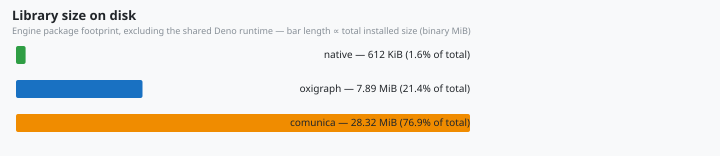

# Verification & Testing

How the engine is verified — unit tests, differential parity, the
[W3C](https://www.w3.org/) gates, benchmarking, and debugging the query
pipeline.

## The verification pyramid

```
      W3C differential gates        test/w3c/ (vs Comunica + spec results)
    Differential parity             test/parity/ (vs Comunica, 1:1)
  Unit / integration tests          src/**/*.test.ts
Typecheck + lint + fmt + parser     deno task check / lint / fmt:check / parser:check
```

Every layer runs in CI (`.github/workflows/ci.yml`): the `ci` job runs
`deno task ci` (plus explicit `test:exists-ref` and `publish:dry` steps),
`w3c-parity` runs `deno task test:w3c` + `deno task test:exists-ref`,
`interface-parity` gates the shared interface spec, `latency-snapshot` re-checks
the committed bench inventory, `docs-links` fails on wiki link rot, and
`publish.yml` gates `deno publish`.

## Task reference

| Task                            | Command                        | What it runs                                                                                                          | Gating                     |
| ------------------------------- | ------------------------------ | --------------------------------------------------------------------------------------------------------------------- | -------------------------- |
| `deno task test`                | `deno test --allow-all`        | All unit + integration + parity `*.test.ts` files                                                                     | ci                         |
| `deno task check`               | `deno check`                   | Typecheck the package                                                                                                 | ci                         |
| `deno task fmt:check`           | `deno fmt --check`             | Source **and markdown** formatting (width 80)                                                                         | ci                         |
| `deno task lint`                | `deno lint`                    | Lint                                                                                                                  | ci                         |
| `deno task parser:check`        | `generate-parser.ts --check`   | Generated `parser.ts` in sync with `sparql.jison`                                                                     | ci                         |
| `deno task bench:check`         | `bench/budget.ts`              | Perf regression budget (vs `bench/baseline.json`)                                                                     | ci                         |
| `deno task test:exists-ref`     | `test/w3c/exists-ref.ts`       | EXISTS/NOT EXISTS subquery surface vs Oxigraph                                                                        | ci + w3c-parity            |
| `deno task test:sparql12:gap`   | `test/w3c/sparql12-gap.ts`     | RDF 1.2 eval-triple-terms gap suite                                                                                   | ci                         |
| `deno task test:sparql12`       | `test/w3c/sparql12-main.ts`    | W3C [SPARQL 1.2](https://www.w3.org/TR/sparql12-query/) evaluation suite                                              | ci                         |
| `deno task test:rdf11`          | `test/w3c/rdf-differential.ts` | RDF 1.1 Turtle/TriG/N-Triples/N-Quads vs n3                                                                           | ci                         |
| `deno task test:rdf12`          | `test/w3c/rdf-classify.ts`     | RDF 1.2 syntax classifier                                                                                             | ci                         |
| `deno task publish:check`       | `test/publish-graph-check.ts`  | Default export graph has no `node:`/`npm:` runtime imports; `./sqlite` pulls exactly `node:sqlite`                    | ci                         |
| `deno task ci`                  | —                              | All of the above in dependency order                                                                                  | ci job                     |
| `deno task test:w3c`            | `test/w3c/w3c-main.ts`         | [SPARQL 1.1](https://www.w3.org/TR/sparql11-query/) evaluation-core differential vs [Comunica](https://comunica.dev/) | w3c-parity job             |
| `deno task docs:link-check`     | `docs/link-check.ts`           | Wiki link rot: every external markdown link (JSR/GitHub/W3C/…) must resolve (404/410 fails)                           | docs-links job             |
| `deno task interface-parity`    | `test/interface-parity.ts`     | `src/sparql-engine-interface.ts` matches `@worlds/client`'s copy (line endings normalized)                            | interface-parity job       |
| `deno task bench:latency:check` | `bench/latency-check.ts`       | Committed `bench/latency-data.json` bench inventory matches a fresh run                                               | latency-snapshot job       |
| `deno task test:ref`            | `test/w3c/ref-crosscheck.ts`   | Allowlisted divergence audit vs Oxigraph + N3.js                                                                      | manual (on grammar change) |
| `deno task bench`               | `deno bench --allow-all`       | Three-engine benchmarks                                                                                               | manual                     |
| `deno task bench:sqlite`        | `bench/sqlite_bench.ts`        | Durable `SqliteStore` vs `MemoryStore` operation timings                                                              | manual                     |
| `deno task bench:latency`       | `bench/latency-chart.ts`       | Render `bench/latency-data.json` → `docs/assets/chart-latency.svg`                                                    | manual                     |
| `deno task publish:dry`         | `deno publish --dry-run`       | JSR publish validation                                                                                                | ci job + publish job       |

## Unit & integration tests

`deno test` discovers `*.test.ts` alongside sources and under `test/`:

```bash
deno test src/              # engine internals only (fast loop)
deno test src/wazoo-sparql-engine.test.ts   # single file
deno test -n "exists"       # filter by test name substring
```

Covered areas: parser (`src/parser/mod.test.ts`, `turtle-parser.test.ts`), store
semantics (`src/store/memory-store.test.ts`, `sqlite-store.test.ts`,
`sqlite-store-recovery.test.ts`), quad-store adapters
(`src/quad-store.test.ts`), the join engine (`src/evaluator/join.test.ts`), the
planner (`src/planner/*.test.ts`), term algebra (`src/term/term.test.ts`),
updates (`src/evaluator/update-evaluator.test.ts`), and the engine integration
suite (`src/wazoo-sparql-engine.test.ts`) — including the concurrent-`execute()`
isolation tests for the EXISTS snapshot (issue
[#72](https://github.com/wazootech/sparql-engine/issues/72)).

## Differential parity (the project's core test)

The parity contract is **behavioral equivalence with
`@comunica/query-sparql-rdfjs-lite`**, the engine this project ports 1:1. See
`test/parity/parity.test.ts` and `parity-update.test.ts`:

- Each case seeds both engines with identical RDF/JS stores, runs the same
  query, and deep-compares observable results: SELECT bindings (with ORDER BY
  emission order compared exactly), ASK booleans, CONSTRUCT quads, and — for
  updates — final store contents.
- **Blank nodes compare by identity, not label.** Comunica skolemizes blank-node
  labels to `bc_<sourceId>_<label>`; the harness strips the prefix
  (`normalizeComunicaBlankNodeLabel` in `test/parity/parity-harness.ts`) because
  SPARQL 1.1 result semantics treat labels as scoped and opaque. A dedicated
  test locks in this known difference against real Comunica output, so the
  normalization stays verified rather than assumed.
- The canonicalization itself is unit-tested:
  `test/parity/canonical-store.test.ts` locks in `canonicalStoreQuads`'
  blank-node substitution — repeated placeholders within one quad (`replaceAll`,
  e.g. the same blank node bound as subject and object), distinct-node
  preservation, and multi-quad isomorphism under relabeling.
- **CONSTRUCT compares under the graph-result contract (issue
  [#87](https://github.com/wazootech/sparql-engine/issues/87)).** A CONSTRUCT
  result is a set of triples: the reference side (Comunica) is normalized to
  graph content — its stream may repeat a triple its graph would not — while the
  wazoo side is compared **as-emitted**. A conforming engine emits no duplicate
  quads (W3C decision #29), so a change that starts emitting duplicates fails
  the gate instead of silently passing; `test/w3c/construct-semantics.test.ts`
  pins the contract with unit tests on `compareConstructRecords`/`dedupeRecords`
  (`test/w3c/runner.ts`).
- Updates canonicalize stores up to blank-node relabeling — two stores pass when
  they agree exactly modulo label identity (the SPARQL contract, since INSERT
  DATA mints fresh labels per execution).
- **Spec-wins divergences**: when Comunica contradicts the spec (e.g. `LIMIT 0`
  ignored, malformed regex throwing), the wazoo engine implements the spec,
  documents the divergence, and skips the parity case — see
  `test/w3c/divergences.ts`.

## W3C suites

`deno task test:w3c` runs the vendored W3C SPARQL 1.1 **evaluation-core**
(aggregates, bind, bindings, cast, construct, exists, functions, grouping,
negation, project-expression, property-path, subquery, and the update
categories) **differentially**: every query runs through both Comunica and the
wazoo engine, and observable results are compared. Categories per test:

- `pass` — both engines agree.
- `gap` — wazoo and Comunica disagree; the gap count is the tracked progress
  metric and the gate stays red until it reaches zero.
- `error` — the runner itself failed.
- `documented divergence` — keyed in `divergences.ts`; validated against the W3C
  reference result instead of Comunica.
- `conformance` — soft cross-check of the spec-expected result where parseable.

The SPARQL 1.2 gates are similar but larger-surface: `test:sparql12`
(differential vs Comunica, including the four direction functions and RDF 1.2
triple terms) and `test:sparql12:gap` (the RDF 1.2 eval-triple-terms gap suite,
where Comunica's parser lags).

The RDF syntax gates validate the in-repo Turtle/TriG/N-Triples/N-Quads parser
backing `LOAD`:

- `test:rdf11` — differential vs `n3@2.2.0` on accept/reject **and** resulting
  quads (up to blank-node relabeling); negative tests are gated absolutely.
- `test:rdf12` — manifest classifier: positive syntax must parse, negative must
  be rejected, eval tests must be isomorphic to their `.nt`/`.nq` reference.
- `test:ref` — audits every allowlisted divergence against Oxigraph and N3.js so
  no accepted-but-universally-rejected construct slips in.

All fixtures are vendored under `test/w3c/fixtures/` (no network needed);
refresh instructions live in `test/w3c/README.md`.

## Benchmarking

Each tool's methodology is on the dedicated
[07 — Benchmarking & Performance](07-benchmarking.md) page (the measured numbers
live in the root `README.md`); this section covers how to run each tool and what
it gates.

### `deno task bench` — three-engine comparison

`bench/engine_bench.ts` compares the wazoo engine against
`@comunica/query-sparql-rdfjs-lite` and **Oxigraph (WASM)** over an identical
generated graph (400 people, ~1,600 quads, plus named-graph datasets).

Two properties make the timings trustworthy:

1. **Verification first.** Before any timing, every query asserts all three
   engines return identical results (`verifySelectEquality`,
   `verifyAskEquality`, `verifyConstructEquality`, `verifyConstructIsoEquality`
   — CONSTRUCT under the graph-result multiset contract: reference deduplicated,
   wazoo as-emitted (issue
   [#87](https://github.com/wazootech/sparql-engine/issues/87)) — and every
   update asserts identical final store contents on fresh stores
   (`verifyUpdateEquality`). A benchmark of a broken engine fails loudly, not
   silently.
2. **Self-restoring updates.** The timed update deletes and re-inserts the same
   quads, netting to zero per iteration, so the benchmark stores never drift.

Groups cover the feature surface: scan, join, asym-join (reorder on/off),
reorder-chain, ask, construct, update, optional, minus, union, path,
group-aggregate, filter-expr, order-limit, distinct, values-bind, graph, from,
subquery, exists, cast, string-fn, having, reduced, update-ops. The
`reorder-chain` group demonstrates the dynamic join planner (see
[07 — Benchmarking & Performance](07-benchmarking.md)): reordering makes the
worst-case-ordered chain fast, at parity with Oxigraph.

### `deno task bench:check` — regression budget

`bench/budget.ts` runs two queries (a 2-pattern BGP join and a reorder chain)
50× against a 100-subject store and fails if average latency exceeds
`maxAllowedMs: 50` from `bench/baseline.json`. This is the CI perf gate.

### `bench/concurrency-probe.ts` — EXISTS concurrency stress

Standalone probe for issue #72 (a concurrent `execute()` must never observe
another call's EXISTS snapshot rebuild). Five queries cover the EXISTS surface —
flat, `NOT EXISTS`, nested, `ORDER BY`, and `GROUP BY` + `OPTIONAL` — over a
300-subject store:

1. **Static-store concurrency** — 40 rounds of the shuffled query mix run via
   `Promise.all`, asserting every round matches the sequential baseline
   byte-for-byte.
2. **Update interleaving** — 20 rounds of a self-restoring DELETE/INSERT UPDATE
   running concurrently with EXISTS queries, asserting no call errors (exact
   results are undefined mid-mutation).

Any error or divergence exits 1:

```bash
deno run --allow-all bench/concurrency-probe.ts
```

The same guarantees are locked in as unit tests in
`src/wazoo-sparql-engine.test.ts`.

### `deno task bench:size` / `bench:size:closures` / `bench:memory` — footprint measurement

Latency is only half the story: the engine is also benchmarked on what it costs
to ship and run (root `README.md` → _Size & memory footprint_):

- `bench:size` — `bench/measure-libs.ts` measures the on-disk footprint a
  consumer must install: the wazoo JSR artifact (zero runtime deps) vs the
  Oxigraph npm package vs Comunica's full transitive closure →
  `bench/size-data.json`. The JSR `publish.exclude` set (grammar sources,
  `generate-parser.ts`) is applied before measuring, so the number is what
  consumers actually install.
- `bench:size:closures` — `bench/measure-closures.ts` walks the value-import
  graph of each package entrypoint (`.`, `./term`, `./store`, `./sqlite`,
  `./parser`, `./serialize`), skipping type-only imports, and reports the total
  local bytes each one loads (from the serializers to the full engine) →
  `bench/closures-data.json`.
- `bench:memory` — `bench/collect-memory.ts` spawns `bench/memory-probe.ts` per
  engine in an **isolated Deno subprocess** (so only the target engine is
  loaded), reporting peak `Deno.memoryUsage().heapUsed` over 5 runs on a
  10k-person graph (~55k quads), across a full-scan and a nested-EXISTS workload
  → `bench/memory-data.json`. Wazoo is lowest on both workloads.
- `bench/treemap.ts` renders the JSON snapshots into `docs/assets/chart-*.svg`
  (bar charts) and `docs/assets/treemap-memory.svg` (treemap):

<figure>
  
  <figcaption><b>Fig — Library size on disk.</b> One bar per engine; bar
  length is proportional to total installed size (values in binary MiB, share
  of the combined total in parentheses). Wazoo (green) is a sliver against
  Comunica’s transitive closure (orange); oxigraph (blue) sits between.</figcaption>
</figure>

<figure>
  
  <figcaption><b>Fig — Peak heap during execution</b> (10k-person graph).
  One panel per workload (full scan, nested EXISTS); within each, the three
  engines’ tiles are scaled by their peak `heapUsed` (values in MiB). Wazoo
  (green) is the smallest tile in both panels.</figcaption>
</figure>

These are machine-specific snapshots, not guarantees — regenerate with the three
tasks above and commit the updated SVGs.

## Debugging guide

### 1. Inspect the parsed AST (the "query plan")

The engine has no separate algebra IR — the sparqljs AST is the closest thing to
a query plan. Dump it:

```bash
deno eval '
import { SparqlParser } from "./src/parser/sparql-parser.ts";
const ast = new SparqlParser().parse(
  "SELECT ?city (COUNT(*) AS ?cnt) WHERE { ?s <http://example.org/city> ?city } GROUP BY ?city HAVING (COUNT(*) > 1) ORDER BY ?city",
);
console.log(JSON.stringify(ast, null, 2));
'
```

You can see the algebra operators the evaluator will run: `group` + `having` +
`order` + projection expressions map 1:1 onto
[`applySelectPipeline()`](https://github.com/wazootech/sparql-engine/blob/main/src/evaluator/select-pipeline.ts)
stages (see [02 — Architecture](02-architecture.md)).

### 2. Inspect what the store sees

The engine evaluates over any `rdfjs.Store`. Dump the store the evaluator uses
to check scoping:

```bash
deno eval '
import { DataFactory, MemoryStore } from "./src/mod.ts";
const { namedNode, literal, quad } = DataFactory;
const store = new MemoryStore();
store.addQuad(quad(namedNode("https://e/s"), namedNode("https://e/p"),
  literal("o"), namedNode("https://e/g")));
console.log(store.getQuads(null, null, null, null));
'
```

[`GraphScopedStore`](https://github.com/wazootech/sparql-engine/blob/main/src/quad-store.ts)
(`src/quad-store.ts`) is a view that fixes the graph term — to trace `GRAPH ?g`
scoping, check which graph term the store view carries.

### 3. Trace a single pipeline stage

- **Join ordering**: `BgpEvaluator.evaluateWithReordering()`
  (`src/evaluator/bgp-evaluator.ts`) and `estimateJoinCost()` print the
  estimated cost per remaining pattern; toggle `reorderPatterns: false` in
  [`WazooSparqlEngineOptions`](https://jsr.io/@wazoo/sparql-engine/doc/~/WazooSparqlEngineOptions)
  to compare written order vs planned order.
- **Hash join**:
  [`joinTriplePattern()`](https://github.com/wazootech/sparql-engine/blob/main/src/evaluator/join.ts)
  (`src/evaluator/join.ts`) shows candidate probing;
  `ScanEntry.candidates.length` is the true store cardinality the planner uses.
- **Expressions**: `ExpressionEvaluator.evaluate()` returns `undefined` for type
  errors and unbound variables — a FILTER that silently drops rows is usually an
  EBV error. `filterPasses()` is the FILTER gate.

### 4. Run one case in isolation

```bash
deno test src/evaluator/update-evaluator.test.ts
deno test -n "nested" src/wazoo-sparql-engine.test.ts
deno task test:w3c   # then read the printed per-test report for gap details
```

The W3C runner prints one line per test with its category
(pass/gap/error/divergence/conformance) — grep for `gap` to list the open parity
defects.

### 5. Watch out

- `deno fmt` formats **markdown** too — keep docs at line width 80 or run
  `deno task fmt` before committing.
- The generated `src/parser/parser.ts` carries `// @ts-nocheck` and
  `// deno-lint-ignore-file`; edit `sparql.jison`, not the generated file, and
  run `deno task parser:generate`.
- [`SqliteStore`](https://github.com/wazootech/sparql-engine/blob/main/src/store/sqlite-store.ts)
  imports `node:sqlite` and is intentionally kept **out of the root export
  graph** — it ships only behind the `./sqlite` subpath, and
  `deno task publish:check`/`publish:dry` fail if the default graph starts
  importing it.
