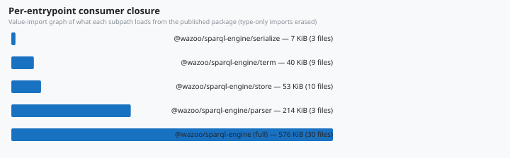
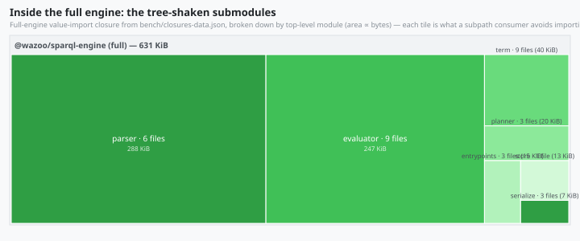

# Benchmarking & Performance

The engine ships six benchmark surfaces — one latency comparison, one CI
regression gate, one concurrency stress probe, and three footprint measurers
(on-disk size, per-entrypoint closure, and peak heap). This page documents the
methodology behind each and the known results measured on the reference machine.
Run instructions live in [05 — Verification & Testing](05-testing.md); this page
is the "why it's trustworthy and what the numbers say" companion.

| Tool                         | Task                            | Measures                                                | Gate |
| ---------------------------- | ------------------------------- | ------------------------------------------------------- | ---- |
| `bench/engine_bench.ts`      | `deno task bench`               | Query/update latency vs Comunica + Oxigraph             | no   |
| `bench/budget.ts`            | `deno task bench:check`         | Latency regression vs `bench/baseline.json`             | CI   |
| `bench/concurrency-probe.ts` | (manual)                        | EXISTS snapshot isolation under concurrency             | no   |
| `bench/measure-libs.ts`      | `deno task bench:size`          | On-disk footprint of each engine                        | no   |
| `bench/measure-closures.ts`  | `deno task bench:size:closures` | Per-entrypoint import closure (what each subpath loads) | no   |
| `bench/collect-memory.ts`    | `deno task bench:memory`        | Peak heap during execution                              | no   |

## `deno task bench` — three-engine latency comparison

`bench/engine_bench.ts` runs the native engine against
`@comunica/query-sparql-rdfjs-lite` and **Oxigraph (WASM)** over identical
generated graphs. Deno's built-in bench runner times each group, with the native
engine as the per-group baseline.

### Why the timings are trustworthy

1. **Verification first.** Before any timing, every query asserts all three
   engines return identical results (`verifySelectEquality`,
   `verifyAskEquality`, `verifyConstructEquality`, `verifyConstructIsoEquality`
   — CONSTRUCT under the graph-result multiset contract: reference deduplicated,
   native as-emitted (issue #87) — and every update asserts identical final
   store contents on fresh stores (`verifyUpdateEquality`). A benchmark of a
   broken engine fails loudly, not silently.
2. **Self-restoring updates.** The timed update deletes and re-inserts the same
   quads, netting to zero per iteration, so the benchmark stores never drift.
3. **Per-group baselines.** Each group is timed independently; results are
   per-iteration averages over the runner's sample window.

Groups cover the feature surface: scan, join, asym-join (reorder on/off),
reorder-chain, ask, construct, update, optional, minus, union, path,
group-aggregate, filter-expr, order-limit, distinct, values-bind, graph, from,
subquery, exists, cast, string-fn, having, reduced, update-ops.

### Known results

Snapshot measured on a Windows desktop, Deno 2.9.5, native engine as the
per-group baseline. Each cell is the per-iteration average; every query was
cross-verified identical on all three engines before timing. Machine-specific —
run `deno task bench` for your own numbers.

Core joins, 400-person graph (~2,200 quads):

| query                        | native   | comunica | oxigraph |
| ---------------------------- | -------- | -------- | -------- |
| full scan                    | 1.3 ms   | 7.6 ms   | 12.2 ms  |
| join (knows × name)          | 1.0 ms   | 5.2 ms   | 2.6 ms   |
| asymmetric join              | 1.4 ms   | 29.2 ms  | 15.1 ms  |
| reorder chain, written order | 136.5 ms | 193.2 ms | 3.2 ms   |
| reorder chain, planner on    | 1.5 ms   | —        | —        |

EXISTS surface, 400-person graph:

| query               | native  | comunica | oxigraph |
| ------------------- | ------- | -------- | -------- |
| `FILTER EXISTS`     | 0.81 ms | 29.2 ms  | 1.0 ms   |
| `FILTER NOT EXISTS` | 0.88 ms | 33.3 ms  | 1.3 ms   |
| nested `EXISTS`     | 1.1 ms  | 134.6 ms | 1.3 ms   |
| nested `NOT EXISTS` | 1.1 ms  | 134.1 ms | 1.2 ms   |

EXISTS surface, 10,000-person graph (~55,000 quads):

| query               | native  | comunica | oxigraph |
| ------------------- | ------- | -------- | -------- |
| `FILTER EXISTS`     | 27.8 ms | 729.5 ms | 27.0 ms  |
| `FILTER NOT EXISTS` | 26.8 ms | 835.9 ms | 30.7 ms  |
| nested `EXISTS`     | 41.3 ms | 3.1 s    | 43.3 ms  |
| nested `NOT EXISTS` | 39.6 ms | 3.2 s    | 32.3 ms  |

Join surface, 10,000-person graph — UNION joins 10k × 20k bindings on the shared
subject (~200M candidate pairs); OPTIONAL and MINUS join 10k × 5k (~50M pairs):

| query               | native  | comunica | oxigraph |
| ------------------- | ------- | -------- | -------- |
| UNION (10k × 20k)   | 45.1 ms | 106.6 ms | 107.5 ms |
| OPTIONAL (10k × 5k) | 22.1 ms | 587.9 ms | 56.5 ms  |
| MINUS (10k × 5k)    | 18.0 ms | 41.7 ms  | 23.1 ms  |

### Reading the numbers

- **Core joins**: native is fastest on every scan/join row, with the asymmetric
  join ~20× faster than Comunica.
- **Join scaling is sub-quadratic.** The native hash join probes an indexed
  right side per left binding instead of scanning it: the nested-loop
  before-state of the UNION benchmark was ~7 s/iter versus 45 ms with the hash
  join (~150×), with OPTIONAL and MINUS showing the same shape (~60-80×).
- **EXISTS is flat as data grows.** Scaling the data 25× (400 → 10,000 people)
  grows native's EXISTS cost ~35-40× while the nested-vs-simple ratio _shrinks_
  (1.45× → 1.12×): the EXISTS snapshot is drained and indexed once per query,
  and each probe touches only its candidate bucket, so nesting stays cheap
  relative to the dataset. Across the EXISTS surface native is 20-180× faster
  than Comunica and roughly at parity with Oxigraph (a compiled Rust/WASM engine
  with native indexes, which stays ahead on the reorder-chain row).
- **The dynamic join planner is worth ~90×** on the worst-case-ordered
  three-pattern chain (136.5 ms → 1.5 ms) — see
  [02 — System Architecture & Query Pipeline](02-architecture.md), Stage 3.

## `deno task bench:check` — regression budget

`bench/budget.ts` is the CI perf gate. It runs two queries — a 2-pattern BGP
join and the reorder chain — 50× each against a 100-subject store and fails if
the average latency exceeds the budget in `bench/baseline.json`:

```json
{
  "maxAllowedMs": 50.0,
  "maxRegressionRatio": 0.15
}
```

A change fails the gate if either query averages more than `maxAllowedMs` (50
ms) or regresses more than `maxRegressionRatio` (15%) versus the recorded
baseline. Tune `bench/baseline.json` deliberately: raise `maxAllowedMs` only for
hardware-dependent thresholds, and re-baseline via the recorded average when a
measured improvement lands.

## `bench/concurrency-probe.ts` — EXISTS concurrency stress

Standalone probe for issue #72 (a concurrent `execute()` must never observe
another call's EXISTS snapshot rebuild). Five queries cover the EXISTS surface —
flat, `NOT EXISTS`, nested, `ORDER BY`, and `GROUP BY` + `OPTIONAL` — over a
300-subject store:

1. **Static-store concurrency** — 40 rounds of a shuffled query mix run via
   `Promise.all`, asserting every round matches the sequential baseline
   byte-for-byte.
2. **Update interleaving** — 20 rounds of a self-restoring DELETE/INSERT UPDATE
   running concurrently with EXISTS queries, asserting no call errors (exact
   results are undefined mid-mutation).

Any error or divergence exits 1; the same guarantees are locked in as unit tests
in `src/wazoo-sparql-engine.test.ts`.

## `deno task bench:size` / `bench:memory` — footprint

### Methodology

- `bench:size` — `bench/measure-libs.ts` measures the on-disk footprint a
  consumer must install: the native JSR publish artifact (`src/` + `README.md`
  - `LICENSE`, broken down by top-level module), the installed Oxigraph npm
    package (WASM binary vs JS glue), and `@comunica/query-sparql-rdfjs-lite`
    plus its full transitive dependency closure → `bench/size-data.json`.
- `bench:memory` — `bench/collect-memory.ts` spawns `bench/memory-probe.ts` per
  engine × workload in an **isolated Deno subprocess** (so only the target
  engine is loaded), executing each workload 5× and reporting peak
  `Deno.memoryUsage()` (`heapUsed` + `rss` + `external`) on a 10,000-person
  graph (~55,000 quads) → `bench/memory-data.json`.
- `bench/treemap.ts` renders the JSON snapshots into
  `docs/assets/chart-library-size.svg` (bar chart),
  `docs/assets/treemap-memory.svg` (treemap), `docs/assets/chart-closures.svg`
  (bar chart), and `docs/assets/treemap-submodules.svg` (full-engine closure
  treemap) — the SVGs are committed, so the published wiki and README stay in
  sync with the measurements.

### Known results

On-disk footprint (what a consumer must have installed):

| engine   | on disk      | contents                                                                                              |
| -------- | ------------ | ----------------------------------------------------------------------------------------------------- |
| native   | **0.60 MiB** | 36 source files (the whole JSR artifact: `src/` + `README.md` + `LICENSE`); zero runtime dependencies |
| oxigraph | 7.9 MiB      | WASM runtime (7.8 MiB) + JS glue/types                                                                |
| comunica | 28.3 MiB     | 368 npm packages in the transitive dependency closure                                                 |

<figure>
  
  <figcaption><b>Fig — Library size on disk.</b> One bar per engine; bar
  length is proportional to total installed size (values in binary MiB, share
  of the combined total in parentheses). Native (green) is the whole JSR
  artifact at 0.60 MiB — a sliver against comunica’s 28.3 MiB closure (orange);
  oxigraph (blue) sits between.</figcaption>
</figure>

Native breaks down as evaluator 226 KiB, parser 294 KiB (the generated
`parser.ts` alone is 202 KiB), term 40 KiB, store 13 KiB, serialize 7 KiB,
README 15 KiB, LICENSE 1 KiB — the parser is the largest single module (the
generated `parser.ts` from `sparql.jison`). The `bench:size` JSON breaks the
artifact into per-file tiles so the chart stays honest: the JSR
`publish.exclude` set (grammar sources, `generate-parser.ts`, `sqlite-store.ts`)
is applied before measuring.

**Per-entrypoint consumer closure** — what importing a subpath actually loads
from the published package (value-import graph, type-only imports erased;
measured by `deno task bench:size:closures`):

<figure>
  
  <figcaption><b>Fig — Per-entrypoint consumer closure.</b> Bar length is the
  total size of the local files each `@wazoo/sparql-engine` entrypoint actually
  loads (file count per bar). The full engine pulls in the whole 576 KiB graph;
  a store-only consumer pays just 53 KiB and the serializers are the cheapest
  leaf at 7.4 KiB.</figcaption>
</figure>

<figure>
  
  <figcaption><b>Fig — Inside the full engine: the tree-shaken submodules.</b>
  Tile area is the share of the full `@wazoo/sparql-engine` import closure
  (576 KiB, 30 files) that each top-level module accounts for — the parser
  (277 KiB) and evaluator (226 KiB) dominate, so a consumer that imports only
  `./serialize` (7 KiB) or `./term` (40 KiB) avoids most of the engine. Each
  subpath closure above is a cut of this graph.</figcaption>
</figure>

| import                               | closure     | files |
| ------------------------------------ | ----------- | ----- |
| `@wazoo/sparql-engine/serialize`     | **7.4 KiB** | 3     |
| `@wazoo/sparql-engine/term`          | 40.3 KiB    | 9     |
| `@wazoo/sparql-engine/store`         | 53.1 KiB    | 10    |
| `@wazoo/sparql-engine/parser`        | 213.8 KiB   | 3     |
| `@wazoo/sparql-engine` (full engine) | 575.9 KiB   | 30    |

Peak heap during execution (`heapUsed`; isolated subprocess per engine, peak
over 5 runs, all three share the same ~62 MiB runtime baseline so the comparison
is symmetric):

| workload             | native      | comunica | oxigraph |
| -------------------- | ----------- | -------- | -------- |
| full scan (55k rows) | **134 MiB** | 214 MiB  | 251 MiB  |
| nested EXISTS        | **82 MiB**  | 271 MiB  | 108 MiB  |

<figure>
  
  <figcaption><b>Fig — Peak heap during execution</b> (10k-person graph).
  One panel per workload (full scan, nested EXISTS); within each, the three
  engines’ tiles are scaled by their peak `heapUsed` (values in MiB). Native
  (green) is the smallest tile in both panels.</figcaption>
</figure>

Native is the smallest on disk by 13-47× (0.60 vs 7.9 vs 28.3 MiB) and holds its
speed advantage with the lowest peak heap on both workloads — including a peak
roughly a third of Comunica's on the nested-EXISTS surface the timings above
highlight. Oxigraph's WASM runtime is compact on disk, but its result
materialization peaks higher than native on both workloads. The probe also
records peak RSS in `bench/memory-data.json` for deeper analysis.

## Regenerating and committing results

```bash
deno task bench        # latency: prints tables, verifies results first
deno task bench:check  # CI gate: pass/fail vs bench/baseline.json
deno run --allow-all bench/concurrency-probe.ts   # exit 1 on any divergence
deno task bench:size   # measure-libs → size-data.json → chart SVGs → fmt
deno task bench:size:closures # measure-closures → closures-data.json → closures chart + submodule treemap SVGs → fmt
deno task bench:memory # collect-memory → memory-data.json → memory treemap SVG → fmt
```

All measurements are machine-specific snapshots (the reference numbers above are
Deno 2.9.5 on Windows), not guarantees. When you regenerate `bench:size` or
`bench:memory`, commit the updated `bench/*-data.json` **and** the
`docs/assets/chart-*.svg` + `docs/assets/treemap-memory.svg` together — the
tasks format the SVGs, so a committed SVG should always be byte-identical to
what `deno fmt` produces.
